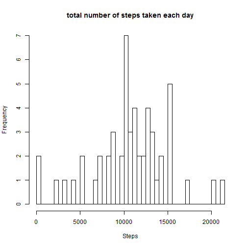
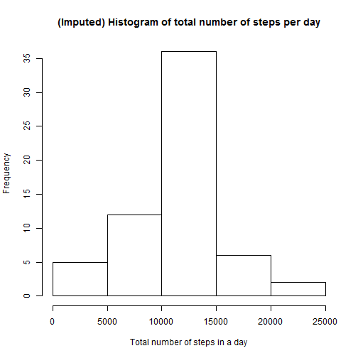
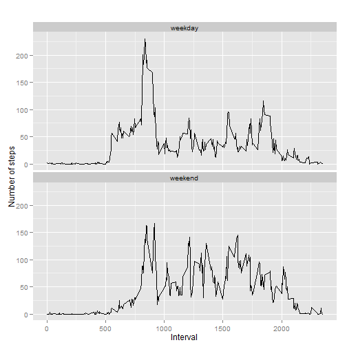

This assignment makes use of data from a personal activity monitoring device. This device collects data at 5 minute intervals through out the day. The data consists of two months of data from an anonymous individual collected during the months of October and November, 2012 and include the number of steps taken in 5 minute intervals each day.

###Loading and preprocessing the data

Loading the data

```r
activity <- read.csv("activity.csv")
```

###What is mean total number of steps taken per day?

1.  The total number of steps taken per day

```r
actByDay <- aggregate(steps ~ date, data = activity, sum)
```

2.  Histogram of the total number of steps taken each day

```r
hist(actByDay$steps, length(actByDay$date), main = "total number of steps taken each day", xlab = "Steps")
```

 

3.  The mean and median of the total number of steps taken per day

```r
summary(actByDay$steps)
```

```
##    Min. 1st Qu.  Median    Mean 3rd Qu.    Max. 
##      41    8841   10760   10770   13290   21190
```

###What is the average daily activity pattern?

1.  Time series plot of the 5-minute interval (x-axis) and the average number of steps taken, averaged across all days (y-axis)

```r
steps_interval <- aggregate(steps ~ interval, data = activity, FUN = mean)
plot(steps_interval, type = "l")
```

 

2 Which 5-minute interval, on average across all the days in the dataset, contains the maximum number of steps?

```r
max_ave_Steps <- steps_interval$interval[which.max(steps_interval$steps)]
steps_interval[steps_interval$interval == max_ave_Steps,]
```

```
##     interval    steps
## 104      835 206.1698
```

###Imputing missing values

1.  The total number of missing values in the dataset (i.e. the total number of rows with NAs)

```r
sum(is.na(activity))
```

```
## [1] 2304
```

2.   Filling in all of the missing values in the dataset using the mean for that day

```r
activity_imp = activity
for (i in 1:nrow(activity)){
  if (is.na(activity$steps[i])){
    row_id <- which(steps_interval$interval == activity$interval[i])
    activity_imp$steps[i] <- steps_interval$steps[row_id]
  }
}
```

3.  New dataset that is equal to the original dataset but with the missing data filled in

original Data -

```r
str(activity)
```

```
## 'data.frame':	17568 obs. of  3 variables:
##  $ steps   : int  NA NA NA NA NA NA NA NA NA NA ...
##  $ date    : Factor w/ 61 levels "2012-10-01","2012-10-02",..: 1 1 1 1 1 1 1 1 1 1 ...
##  $ interval: int  0 5 10 15 20 25 30 35 40 45 ...
```
v/s New Data -

```r
str(activity_imp)
```

```
## 'data.frame':	17568 obs. of  3 variables:
##  $ steps   : num  1.717 0.3396 0.1321 0.1509 0.0755 ...
##  $ date    : Factor w/ 61 levels "2012-10-01","2012-10-02",..: 1 1 1 1 1 1 1 1 1 1 ...
##  $ interval: int  0 5 10 15 20 25 30 35 40 45 ...
```

```r
sum(is.na(activity_imp))
```

```
## [1] 0
```

4.  The histogram of the total number of steps taken each day 

```r
actByDay_imp <- aggregate(steps ~ date, data = activity_imp, sum)
hist(actByDay_imp$steps, main="(Imputed) Histogram of total number of steps per day", xlab="Total number of steps in a day")
```

 

The mean and median total number of steps taken per day

```r
summary(actByDay_imp$steps)
```

```
##    Min. 1st Qu.  Median    Mean 3rd Qu.    Max. 
##      41    9819   10770   10770   12810   21190
```

Do these values differ from the estimates from the first part of the assignment? 
What is the impact of imputing missing data on the estimates of the total daily number of steps?

###Are there differences in activity patterns between weekdays and weekends?

1.  Creating a new factor variable in the dataset with two levels - "weekday" and "weekend" indicating whether a given date is a weekday or weekend day.

```r
activity_imp$day <- weekdays(as.Date(activity_imp$date))
# add a new column called day type
activity_imp$day_type <- "weekday"
# If day is Saturday or Sunday, make day_type as weekend
activity_imp[activity_imp$day == "Saturday" | activity_imp$day == "Sunday", 5] <- "weekend"
# convert day_time from character to factor
activity_imp$day_type <- as.factor(activity_imp$day_type)
```

A panel plot containing a time series plot of the 5-minute interval (x-axis) and the average number of steps taken, averaged across all weekday days or weekend days (y-axis).

```r
steps_interval_imp <- aggregate(steps ~ interval+day_type, data = activity_imp, FUN = mean)
library(ggplot2)
qplot(interval, steps, data=steps_interval_imp, geom=c("line"), xlab="Interval", 
      ylab="Number of steps", main="") + facet_wrap(~ day_type, ncol=1)
```

 
